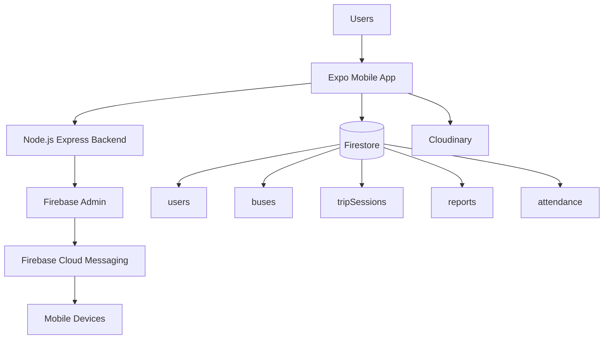
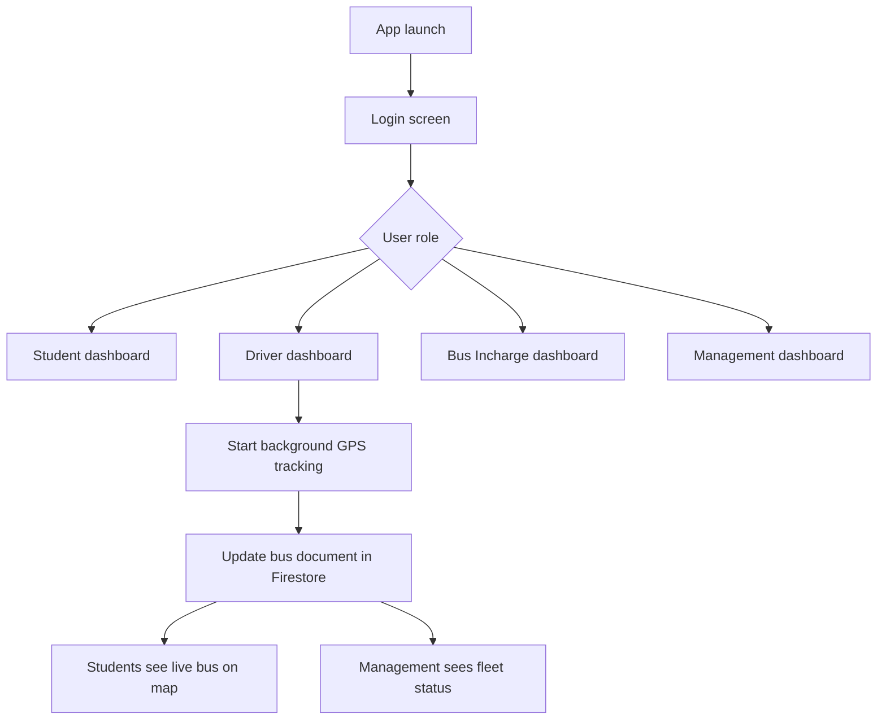

# SIET Bus Tracking App - Interview README

> Short, interview-focused guide for explaining the project clearly in Technical HR and project review rounds.

## 1. Project Overview

SIET Bus Tracking App is a React Native + Expo application for college bus management.
It supports four roles:

- Student
- Driver
- Bus Incharge / Co-admin
- Management

The app solves a practical transport problem:

- students cannot see live bus movement,
- drivers need a simple way to share GPS updates,
- bus incharge needs attendance and report handling,
- management needs a central dashboard.

---

## 2. What the Project Does

- Tracks live bus location on a map
- Starts and stops trip sessions from the driver app
- Sends push notifications through Firebase Cloud Messaging
- Lets students submit reports and view report history
- Lets bus incharge prepare attendance submissions
- Gives management access to buses, drivers, students, reports, and analytics

---

## 3. Tech Stack and Why It Was Used

| Technology         | Why it is used                                                  |
| ------------------ | --------------------------------------------------------------- |
| React Native       | Cross-platform mobile app                                       |
| Expo SDK 54        | Fast development and native module support                      |
| React Navigation   | Role-based screen routing                                       |
| Firebase Firestore | Real-time data storage for users, buses, trips, reports, tokens |
| Firebase Messaging | Push notifications on Android device                            |
| Firebase Admin     | Secure server-side notification sending                         |
| Node.js + Express  | Backend relay for notifications                                 |
| Expo Location      | Foreground and background GPS tracking                          |
| Expo Task Manager  | Keeps driver tracking active in background                      |
| AsyncStorage       | Stores local session and cached user data                       |
| Cloudinary         | Profile image upload                                            |

---

## 4. Architecture Diagram



### Simple explanation

- The mobile app handles UI, login, maps, and GPS.
- Firestore stores live app data.
- The Node.js backend sends notifications securely.
- Cloudinary stores profile images.

---

## 5. Folder Structure

```text
sietbusapp/
├── App.js
├── index.js
├── app.config.js
├── eas.json
├── scripts/
├── server/
└── src/
    ├── components/
    ├── hooks/
    ├── navigation/
    ├── screens/
    ├── services/
    └── utils/
```

### What each part means

- `App.js`: loads fonts, splash screen, and notification listeners.
- `index.js`: registers the app and background FCM handler.
- `src/navigation`: screen routing.
- `src/screens`: user-facing pages.
- `src/services`: business logic for auth, tracking, reports, attendance, and notifications.
- `server`: backend notification relay.
- `scripts`: one-time CSV import and Firestore seeding.

---

## 6. Project Flow



### Interview-friendly flow

1. App launches.
2. User logs in.
3. Role is checked.
4. Correct dashboard opens.
5. Driver starts tracking.
6. GPS updates are written to Firestore.
7. Other users see real-time updates.
8. Notifications and reports flow through the backend and Firestore.

---

## 7. Screen-by-Screen Explanation

### Welcome Screen

First entry screen. It introduces the app and sends the user to login.

### Unified Login Screen

Single login for all roles. It checks Firestore user data, stores a local session, and redirects by role.

### Student Dashboard

Student home screen for tracking, reports, attendance, and profile access.

### Driver Dashboard

Driver control screen for starting and stopping live tracking.

### Bus Incharge Dashboard

Used for attendance, reports, and bus-related actions.

### Management Dashboard

Admin control center for buses, drivers, students, reports, and analytics.

### Map / Live Tracking Screens

Show the current bus location in real time using Firestore and `react-native-maps`.

### Reports Screens

Let students and bus incharge submit reports and allow management to review them.

### Attendance Screen

Collects bus attendance and prepares an email-style submission.

---

## 8. Authentication Flow

The current runtime auth model is **Firestore + local session storage**.

### Flow

1. User enters login details.
2. `authService.login()` checks the Firestore `users` collection.
3. Password and role are verified.
4. A synthetic session token is stored in AsyncStorage.
5. Current user data is cached locally.
6. App routes to the correct dashboard.

### Interview answer

> The project uses Firestore-backed login with local session storage for speed and simplicity. In a production-hardening phase, I would move this to Firebase Auth or JWT-based sessions.

---

## 9. Firestore Structure

| Collection        | Purpose                                                |
| ----------------- | ------------------------------------------------------ |
| `users`           | Student, driver, bus incharge, and management profiles |
| `buses`           | Live bus tracking document                             |
| `tripSessions`    | Trip start/stop and event history                      |
| `reports`         | User-submitted reports                                 |
| `attendance`      | Attendance history read by screens                     |
| `registeredUsers` | Helper lookup data for reports                         |

### Typical document usage

- `users/{id}` stores profile, role, bus assignment, and FCM tokens.
- `buses/{busNumber}` stores current location and tracking status.
- `tripSessions/{sessionId}` stores trip lifecycle data.
- `reports/{reportId}` stores issue reports and responses.

---

## 10. Node.js Backend Flow

The backend is an Express server that mainly handles push notifications.

### Endpoints

- `GET /` health check
- `POST /send-notification` direct FCM send
- `POST /startBus` bus-start notification fan-out
- `POST /notify` targeted user notification

### Flow

1. App sends request to backend.
2. Backend validates request.
3. Firebase Admin sends FCM message.
4. Target device receives the notification.

### Interview answer

> I separated notification delivery into a Node.js backend so admin credentials stay off the client and notification fan-out stays secure.

---

## 11. Firebase Cloud Messaging

FCM is used for bus alerts and user notifications.

### Lifecycle

1. App requests notification permission.
2. Device token is fetched.
3. Token is stored in Firestore under the user profile.
4. On token refresh, the token is updated.
5. Backend sends notification using Firebase Admin.
6. Device receives the notification in foreground, background, or terminated state.

### Foreground / Background / Terminated

- **Foreground:** app handles message with an in-app listener.
- **Background:** user taps notification to return to app.
- **Terminated:** app reads the initial notification when opened.

### Interview answer

> The app stores the FCM token per user in Firestore and uses a Node.js backend with Firebase Admin to send push notifications securely.

---

## 12. Key Services

| Service                        | What it does                                              |
| ------------------------------ | --------------------------------------------------------- |
| `authService.js`               | Login, logout, profile sync, local session storage        |
| `locationService.js`           | Saves bus GPS data to Firestore                           |
| `backgroundLocationService.js` | Runs driver tracking in background                        |
| `pushNotificationService.js`   | Handles FCM token registration and notification listeners |
| `reportsService.js`            | Submit and manage reports                                 |
| `attendanceService.js`         | Builds attendance email drafts                            |
| `tripSessionService.js`        | Tracks trip start/stop and event records                  |

---

## 13. Challenges and Solutions

| Challenge                                 | Solution                                            |
| ----------------------------------------- | --------------------------------------------------- |
| Live GPS tracking without too many writes | Throttle updates by distance and time               |
| Background tracking on Android            | Use Expo Task Manager + background permissions      |
| Notifications for different roles         | Store FCM tokens and let backend decide recipients  |
| Role-based navigation                     | Route users to different dashboards after login     |
| Build compatibility                       | Align Expo packages and validate with `expo-doctor` |

---

## 14. Security

### Honest interview points

- Auth is currently session-based, not full JWT.
- Passwords are stored in Firestore in the current implementation, so this should be hardened for production.
- Firebase Admin is correctly kept on the server.
- Firestore rules should restrict writes by role.
- Secrets should not live in the client bundle.

### Strong security answer

> The secure part of the design is the backend notification path through Firebase Admin. For production, I would further strengthen the system with Firebase Auth or JWT and stricter Firestore rules.

---

## 15. Common HR Interview Questions

### Why did you choose React Native and Expo?

Because it gave me fast cross-platform development while still supporting background location, push notifications, and EAS builds.

### Why Firestore?

Because the app needs real-time data sync for bus tracking and notifications.

### Why a Node.js backend?

Because notification sending should stay server-side, not in the mobile client.

### What is the main feature?

Live bus tracking with role-based dashboards.

### What would you improve next?

I would move authentication to Firebase Auth or JWT and harden Firestore security rules.

---

## 16. 8–10 Minute Explanation Script

> "I built the SIET Bus Tracking App to solve a real transport issue in a college environment. The problem was that students had no reliable way to see bus movement, attendance was handled manually, and communication was fragmented. This app brings everything into one system.

> It is built with React Native and Expo, and Firestore is the main real-time database. The app is role-based, so students, drivers, bus incharge users, and management all see different dashboards.

> The driver app uses Expo Location and background tracking to capture GPS updates. Those updates are written into Firestore under the bus document, and students and management read them in real time on the map screen.

> For notifications, the app stores each device’s FCM token in Firestore. When a bus starts or a targeted alert is needed, the mobile app calls a Node.js backend. That backend uses Firebase Admin to send the push notification securely.

> Reports are stored in Firestore, so students can submit issues and management can review them centrally. Attendance is handled through the bus incharge flow and is prepared in a structured format for submission.

> The most important engineering challenge was balancing live GPS tracking, battery usage, database writes, and reliable notification delivery. The next hardening step would be Firebase Auth or JWT and stricter Firestore security rules."

---

## 17. Quick Interview Summary

> SIET Bus Tracking App is a React Native + Expo transport management system that uses Firestore for live bus tracking, reports, user data, and notification tokens. Drivers update GPS in the background, students see buses live on the map, and a Node.js backend with Firebase Admin sends push notifications securely.

---

## 18. Final Note

This version is intentionally short and interview-focused.
If needed, I can also make a **one-page version**, a **bullet-point cheat sheet**, or a **mock Q&A sheet** for interview practice.
